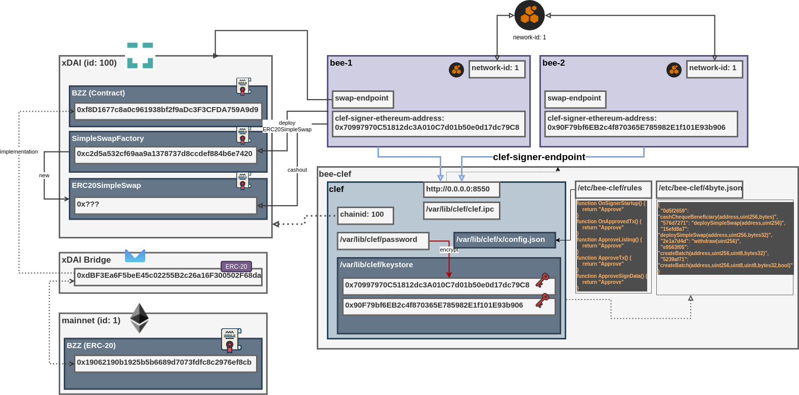

# Swarm Bee Tools

xDAI BZZ (Bridged): [0xdBF3Ea6F5beE45c02255B2c26a16F300502F68da](https://blockscout.com/xdai/mainnet/address/0xdBF3Ea6F5beE45c02255B2c26a16F300502F68da)

---

### Misc Snippets for Swarm Bee

1. [cashout-stat-sql](cashout-stat-sql) - Cashout stats with SQL
2. [cashout-stat-etherscan](cashout-stat-etherscan) - Cashout stats with Ethrescan
3. [tx-replay](tx-replay) - Various transaction tools (replay failed tx, gas costs)
4. [eth-keystore](eth-keystore) - Ethereum standard keystore (create/read Private Key)
5. [erc20](erc20) - Contract queries
6. [clef](clef) - clef utils
7. [cashout](cashout) - cashout utils